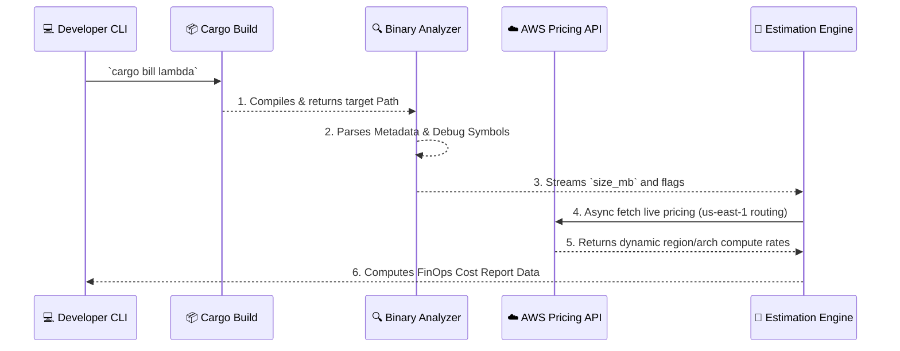

# 🦅 cargo-bill


`cargo-bill` is a specialized FinOps and Platform Engineering CLI tool designed for Rust developers targeting **AWS Lambda**. By statically analyzing your compiled binary footprint and intelligently parsing your dependency tree, it provides predictive computing costs and mathematically sound Cold Start estimations before you even deploy.

---

## 🏗️ Architecture Flow



---

## 🚀 Installation & Usage

`cargo-bill` is a cargo subcommand. You can run it effortlessly on any internal Rust API project.

### 1. Build from Source
```bash
git clone https://github.com/your-username/cargo-bill.git
cd cargo-bill
cargo install --path .
```

### 2. Basic Estimation
Evaluate overhead for a standard x86 payload on `us-east-1` (defaults):
```bash
cargo run -- bill lambda
```

### 3. Advanced FinOps Evaluation (Graviton)
Evaluate structural cost savings utilizing Amazon's proprietary ARM64 architecture in Frankfurt:
```bash
cargo run -- bill lambda --architecture arm64 --region eu-central-1 --memory 128 --executions 1000000
```

**Example Output:**
```text
Initializing cargo-bill for AWS Lambda cost estimation...
Region: eu-central-1, Memory: 128 MB, Executions: 1000000, Architecture: arm64
Executing `cargo build --release`...

Warning: Your binary is unusually large (15.52 MB).
You are compiling aws-sdk crates (e.g., aws-sdk-s3 or aws-sdk-pricing) potentially with all features enabled.
Consider using default-features = false to reduce Cold Start time.

AWS Lambda Cost Estimation Report:
+-------------------------------------------------+
| Metric                               Value      |
+=================================================+
| Binary Size (MB)                     15.52      |
| Architecture                         arm64      |
| Stripped                             No         |
| Has Debug Symbols                    No         |
| Estimated Monthly Storage Cost       $0.0015    |
| Estimated Cost per 1000000 Requests  $2.9433    |
| Predicted Cold Start Latency         1862.18 ms |
| Dynamic API Pricing Used             Yes        |
+-------------------------------------------------+
```

---

## 🧠 Why This Matters: The Cold Start Algorithm 

When presenting this metric logic to Tech Leads and DevOps Engineers, the "Predicted Cold Start Latency" equation in `cargo-bill` is NOT a simple random guess; it mathematically emulates AWS **Firecracker microVM initialization restrictions.**

### The Virtualization Reality
AWS Lambda allocates CPU power and Network bandwidth strictly proportionally to the **Memory** you configure:
- A `1024 MB` Lambda function is the AWS baseline metric (`Factor = 1.0x`)
- A `128 MB` Lambda is restricted and initializes roughly **8x slower**.

```rust
// The core heuristic formula
let memory_factor = 1024.0 / (memory_mb as f64); 
let cold_start_ms = (size_mb * 15.0) * memory_factor;
```

A monolithic 30MB payload crammed into a cheap 128MB Lambda limits the CPU stream and balloons initialization times into multiple seconds. 
`cargo-bill` dynamically reads your **Dependency Weight** alongside your Cargo Target, predicting this latency lag explicitly so your DevOps team can negotiate optimization triggers before hitting production limits.
